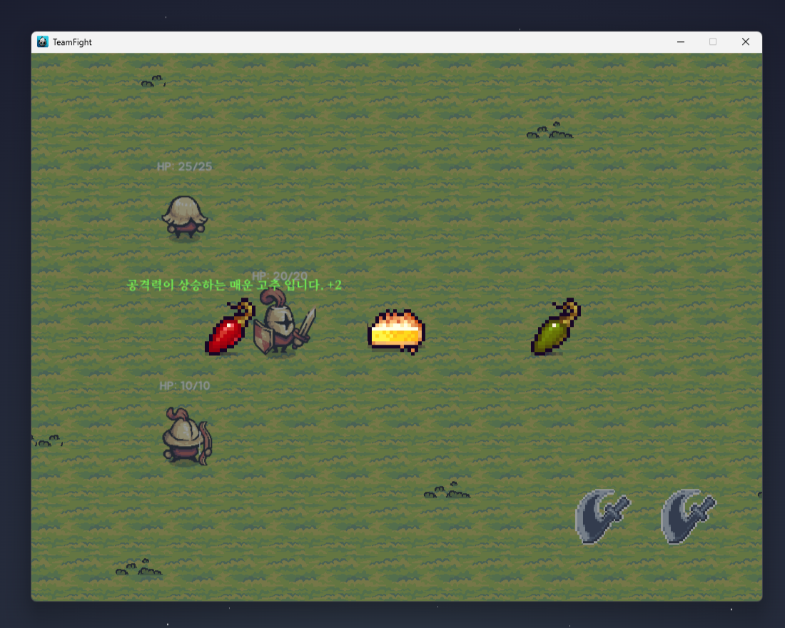
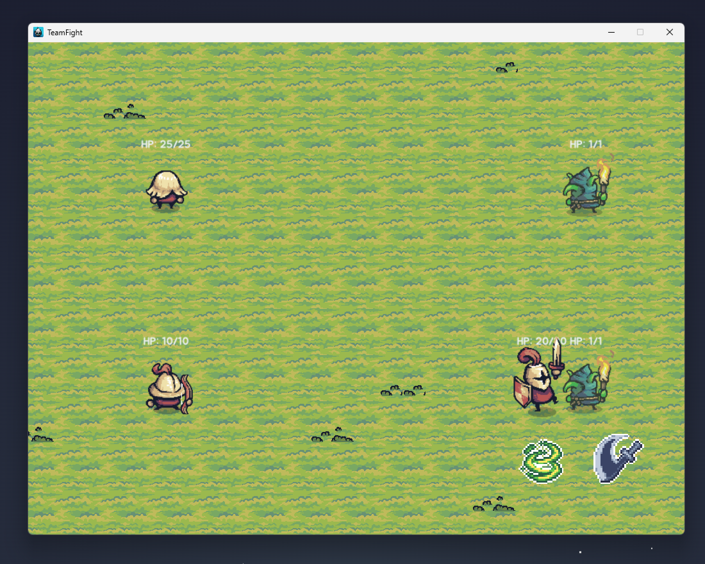

# TeamFight

<aside>

> 📌 현재 개발중인 턴제 게임입니다.

</aside>

  
  

🔗 [유튜브](https://youtu.be/XXkLlENpVm4)  

| 항목 | 내용 |
| --- | --- |
| 🎮 게임 이름 | **Team Fight** |
| 🕹 장르 | 턴제 RPG |
| 🛠 사용 기술 | Cocos2d-x, C++ |
| 👤 역할 | 개인 개발 |
| 📅 개발 기간 | 2025.05.31 ~ 진행 중 |
| 👥 개발 인원 | 1명 |

## ✅ 수행한 역할

### 🔹 시스템 개발
- `BattleManager`를 통해 턴 흐름과 커맨드 처리 시스템을 구현.
- `Command Pattern`을 적용하여 Entity들의 행동을 유연하게 순차 실행.
- `StatController`를 통해 체력, 공격력 등 스탯을 체계적으로 관리.
- `Observer Pattern`을 활용해 `Level`, `GameOver`, `UI 상태 변화` 등을 이벤트 기반으로 처리.

### 🔹 콘텐츠 개발
- Knight, Archer, Pawn 등 각각의 고유 스킬을 가진 Entity 개발.
- 다양한 SpriteSheet에 대응 가능한 범용 `Animator` 시스템 설계 및 구현.
- 레벨 완료 시 보상을 표시하고, 올바른 스프라이트가 출력되도록 시트 연동 처리.

### 🔹 기타 시스템
- `TileMap`을 활용한 배경 구성 및 무한 스크롤링 구현.
- 기본 UI 버튼을 상속한 `JYDButton`을 제작하여 UI 이벤트 확장에 활용.

---

### 🔹 주요 시스템 구성

#### ✅ 턴 및 커맨드 처리 (BattleManager)
- 턴 흐름을 `BattleManager`가 전체적으로 관리합니다.
- 각 행동은 `ICommand` 인터페이스를 구현한 커맨드 객체로 추상화되어 있으며,
  실행 큐에 등록되어 순차적으로 실행됩니다.
- 턴 종료 시 자동으로 다음 유닛으로 제어가 넘어갑니다.

#### ✅ 스탯 시스템 (StatController)
- 각 Entity는 고유한 `StatController`를 가지고 있으며, 체력, 마나, 공격력 등의 스탯을 중앙에서 관리합니다.
- 버프/디버프 효과를 적용하거나 제거할 때에도 이 컨트롤러가 사용됩니다.

#### ✅ 애니메이션 시스템 (Animator)
- 다양한 SpriteSheet에 대응할 수 있도록 범용 애니메이션 시스템을 설계했습니다.
- JSON 기반 애니메이션 정의 또는 프레임 인덱스를 기반으로 작동하며, `Entity`에 종속되어 개별 애니메이션을 실행합니다.

#### ✅ 옵저버 패턴
- 레벨 종료, 체력 0, 특정 이벤트 발생 등은 `Observer` 패턴으로 처리되어 **비동기적**이고 **모듈화된 로직**을 구성합니다.
- 예: `LevelManager`는 클리어 조건을 만족하면 `OnLevelClear` 이벤트를 구독자에게 전달합니다.

#### ✅ 사용자 인터페이스 (JYDButton)
- `JYDButton`은 기존 Cocos 버튼을 확장한 커스텀 UI 컴포넌트입니다.
- 클릭 이벤트 외에도 상태 변화에 따른 애니메이션 트리거나 커맨드 연동 기능을 내장했습니다.

---

## 🧠 프로젝트를 통해 발전한 점
- 익명 함수, 람다 표현식 등의 사용에 익숙해졌습니다.
- `Skill` 추상 클래스를 이용한 객체지향 설계 경험을 통해 코드 재사용성과 유지보수성 향상.
- `Command`, `State`, `Observer` 등 디자인 패턴을 실전에서 활용해본 경험.
- 에픽세븐처럼 복잡한 턴제 전투 구조를 체계적으로 분석하고 구현하는 능력을 키움.

---

